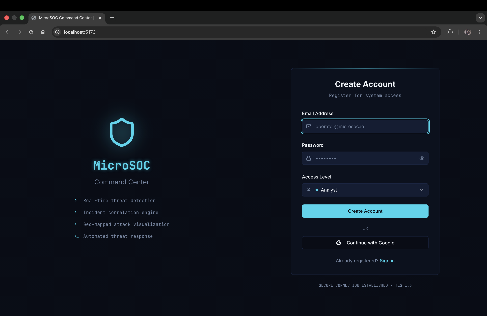
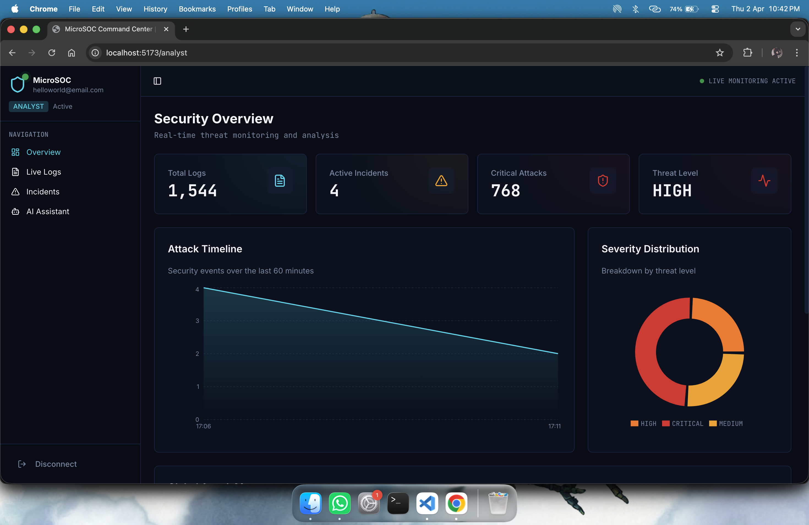
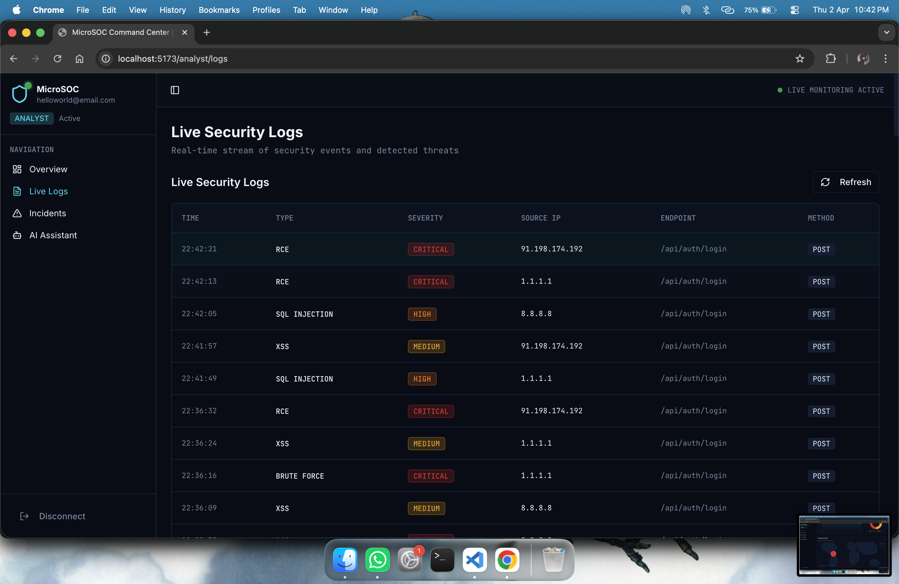
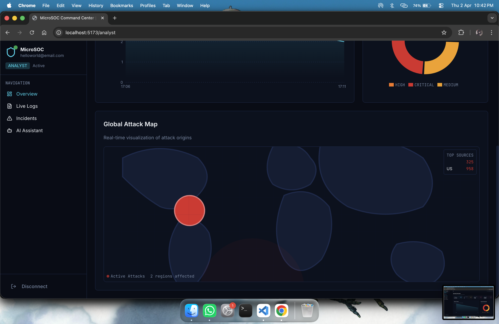
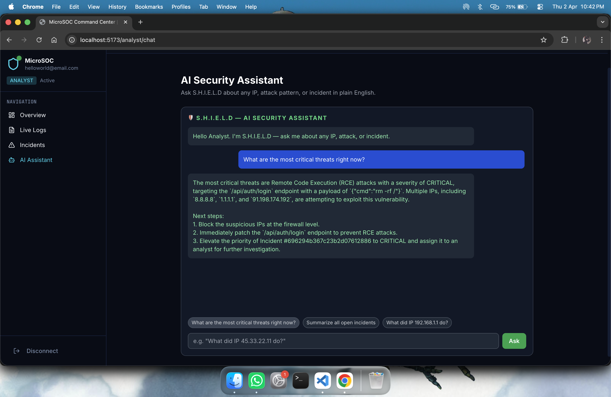
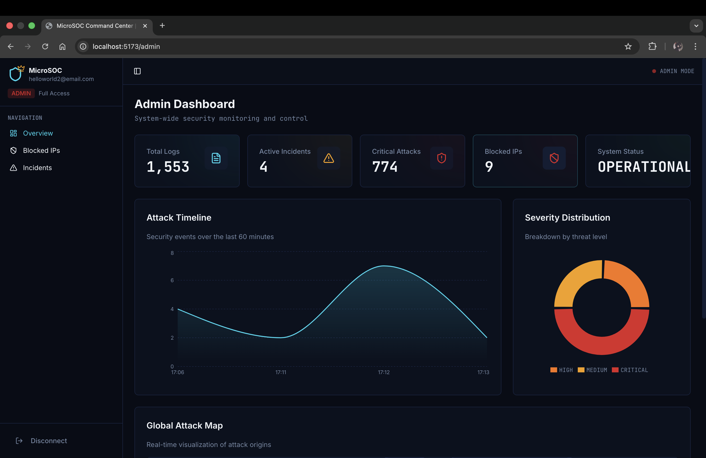
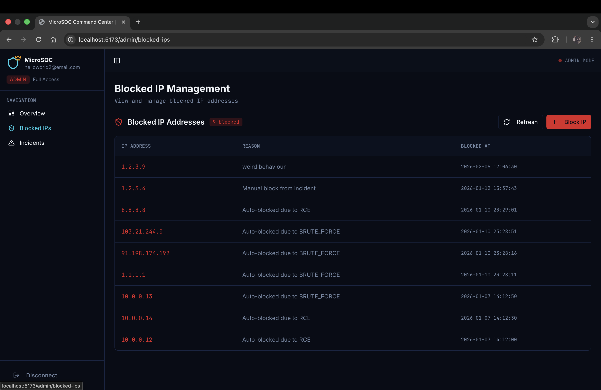

# 🛡️ MicroSOC — Command Center

> A lightweight, full-stack Security Operations Center (SOC) simulator that bridges the gap between theoretical cybersecurity knowledge and hands-on, practical application.


---

## 🧭 What Is MicroSOC?

MicroSOC simulates a realistic SOC environment where you can **monitor**, **analyze**, and **defend** against a continuous stream of auto-generated attack traffic — all in one platform.

It is built for:
- 🎓 **Students** learning cybersecurity hands-on
- 🧪 **Trainers** running controlled attack simulations
- 🔍 **Analysts** practicing incident investigation workflows
- 🛠️ **Developers** exploring security tooling architecture

---

## ✨ Key Features

### 1. 🌐 Real-Time Threat Intelligence Dashboard
- **Live Geomap** — Visualizes attacks on an interactive world map, drawing lines from attacker countries to your servers in real time
- **WebSocket-Powered** — Logs and incidents appear instantly with zero page refreshes
- **Key Metrics** — Tracks Attacks per Minute, Top Attacker IPs, and Severity Distribution
- **Attack Timeline** — A live area chart showing security events over the last 60 minutes
- **Severity Distribution** — Donut chart breaking down threats by HIGH / MEDIUM / CRITICAL

### 2. 🚦 Active Traffic Monitoring & Pre-emptive Shielding
Deep packet inspection on every incoming HTTP request before it hits your database:

| Attack Type | Example Payload | Response |
|---|---|---|
| SQL Injection | `' OR '1'='1` | `403 Forbidden` |
| XSS | `<script>alert(1)</script>` | `403 Forbidden` |
| RCE | `; cat /etc/passwd` | `403 Forbidden` |
| Brute Force | Repeated credential attempts | Auto-blocked + Incident created |

### 3. 📋 Intelligent Incident Management
- **Automated Triage** — High-risk events automatically generate structured Incident tickets
- **Lifecycle Tracking** — Full workflow: `OPEN → ASSIGNED → IN_PROGRESS → RESOLVED`
- **Analyst Notes** — Collaborative notepad per incident for findings, evidence, and actions (suitable for post-mortem reports)

### 4. 🔒 Automated Defense & Auto-Resolve
- **One-Click Block** — Admins can block a malicious IP directly from the Incident console
- **Auto-Resolve** — Simultaneously blocks the IP, closes the incident, and updates the status in one action
- **Blocklist Management** — Dedicated UI to view and manage all active IP bans

### 5. 🤖 AI Security Assistant — S.H.I.E.L.D
An AI-powered RAG (Retrieval-Augmented Generation) chatbot built into the platform:
- Ask natural language questions like _"What did IP 45.33.22.11 do?"_ or _"What are the most critical threats right now?"_
- Pulls context directly from your live security logs and predefined rules
- Returns structured, actionable next steps — not generic advice

### 6. ⚡ Automated Attack Simulator Engine
A background service that continuously generates realistic attack traffic to keep the platform live and testable:
- **Randomized Attack Generation** — Cycles through SQL Injection, XSS, RCE, and Brute Force attacks at a configurable interval (default: every 5 seconds)
- **IP Pool Rotation** — Attacks originate from a curated pool of real-world IPs across different geographies (USA, Australia, Europe) to simulate distributed threats
- **Geo-Resolution** — Each attacking IP is resolved to its geographic location via a caching layer to power the live attack map
- **Auto-Blocking** — Any `CRITICAL` severity attack automatically triggers an IP block entry in the database if not already blocked, with no human intervention required
- **Real-Time Emission** — Every generated attack is instantly broadcast over WebSockets (`log:new`, `attack:blocked`) so the dashboard updates live
- **Incident Correlation** — Each simulated attack feeds into the correlation engine to group related events into structured Incidents automatically

### 7. 🔑 Secure Role-Based Access Control (RBAC)

| Role | Permissions |
|---|---|
| **Analyst** | View logs, use AI chat, update assigned incidents |
| **Admin** | Full access — manage users, block IPs, resolve incidents, configure system |

---

## 🏗️ Tech Stack

| Layer | Technology |
|---|---|
| **Frontend** | React + Vite, TailwindCSS, Recharts |
| **Backend** | Node.js, Express.js |
| **Database** | MongoDB (Atlas) |
| **Real-Time** | WebSockets (Socket.io) |
| **AI / LLM** | Groq API (LLaMA) with RAG pipeline |
| **Auth** | JWT + Role-Based Access Control |
| **Simulator** | Custom background attack engine |

---

## 🚀 Getting Started

### Prerequisites
- Node.js v18+
- MongoDB Atlas account (or local MongoDB)
- Groq API key

### Installation

```bash
# Clone the repository
git clone https://github.com/shristi2006/shield-project
cd microsoc

# Install backend dependencies
cd server
npm install

# Install frontend dependencies
cd ../client
npm install
```

### Environment Variables

Create a `.env` file in the `/server` directory:

```env
PORT=5000
MONGODB_URI=mongodb+srv://<username>:<password>@cluster0.xxxxx.mongodb.net/microsoc
JWT_SECRET=your_jwt_secret_here
GROQ_API_KEY=your_groq_api_key_here
```

### Run the App

```bash
# Start the backend (from /server)
npm run dev

# Start the frontend (from /client)
npm run dev
```

The app will be available at `http://localhost:5173`

---

## 📁 Project Structure

```
microsoc/
├── client/                  # React frontend (Vite)
│   ├── src/
│   │   ├── pages/           # Route-level pages (Login, Dashboard, Logs, etc.)
│   │   ├── components/      # Reusable UI components
│   │   └── context/         # Auth & WebSocket context
├── server/                  # Express backend
│   ├── routes/              # API routes (auth, logs, incidents, blocked-ips)
│   ├── middleware/          # RBAC, attack detection middleware
│   ├── models/              # Mongoose schemas
│   ├── services/            # AI/RAG service, attack simulator, incident correlator
│   └── socket/              # WebSocket event handlers
└── README.md
```

---

## 🔮 Future Improvements

- [ ] Email/Slack alerting for critical incidents
- [ ] Export incident reports as PDF
- [ ] MITRE ATT&CK framework mapping for detected attacks
- [ ] Multi-tenant support for team environments
- [ ] Dark/light theme toggle
- [ ] Dashboard time-range filter (1h / 6h / 24h)
- [ ] Rate limiting and CAPTCHA on login

---

## 👤 Author

Built with ☕ and a healthy fear of `rm -rf /` by Shristi and Deeksha

> _"The best way to learn how to defend is to learn how to attack."_
| Login | Analyst Dashboard | Live Logs |
|---|---|---|
|  |  |  |

| Geo Map | AI Assistant | Admin Dashboard | Blocked IPs |
|---|---|---|---|
|  |  |  |  |

